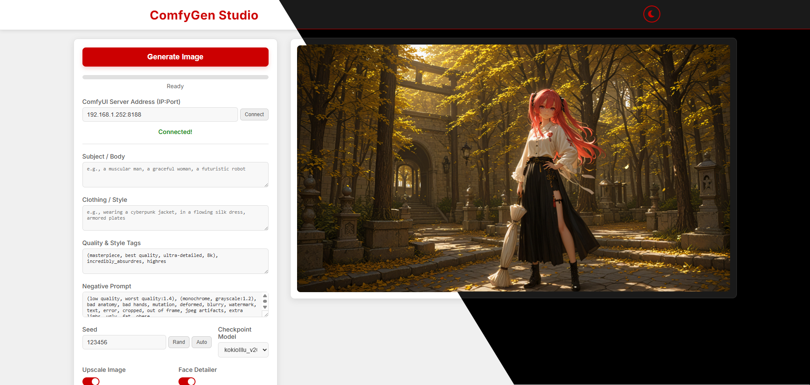

# ComfyGen – Simple WebUI for ComfyUI (Mobile-Friendly)



A clean and minimal WebUI built for [ComfyUI](https://github.com/comfyanonymous/ComfyUI), focused on **mobile usability** and **ease of use**.  
This project was developed for personal workflow needs, but feel free to try it out, improve it, or contribute!

---

## 🚀 Features

- Mobile-friendly interface
- Two deployment options: with ComfyUI or standalone
- Designed for simplicity and quick access

---

## 🔧 Setup (Required for All Methods)

### 1. Enable CORS in ComfyUI

Add the following flag to your ComfyUI startup:

```bash
--enable-cors-header
```

> For **ComfyUI Portable**, add it to `run_nvidia_gpu.bat`.

---

### 2. Open Required Workflows

Open the following two workflows in ComfyUI to ensure all necessary nodes are available:

- `base_workflow`
- `base_workflow2`

You can find them inside the `js` folder. Just open them—no need to edit. just install any missing nodes.

---

## 📦 Deployment Options

### Option 1: Host with ComfyUI

1. Copy the `comfygen-main` folder into:

```bash
ComfyUI_windows_portable/ComfyUI/custom_nodes
```

2. Run ComfyUI as usual.

3. Open your browser and navigate to:

```
http://127.0.0.1:8188/comfygen
```

Or simply append `/comfygen` to your existing ComfyUI IP address.

---

### Option 2: Host Standalone

1. Open the `ComfyGen Studio` folder.

2. Run the server using:

```bash
START.bat
```

3. Access the WebUI at:

```
http://127.0.0.1:8818
```

Or replace `127.0.0.1` with your local IP if accessing from another device.

---

## ⚠️ Known Issue (LoRA Bug)

Due to a bug I haven’t fixed yet, you **must add a LoRA ** even if you don’t plan to use one.

**Workaround:**  
Just add the LoRA and set its **slider to `0`** to disable it.

---

## 🙏 Notes

- This WebUI is still under development and may lack advanced features.
- It’s tailored to my personal workflow, so some design choices are specific to that.
- Feedback and contributions are welcome!

---

## 🗨️ Contact

If you have any issues or suggestions, feel free to open an issue or leave a comment.

Enjoy! ✨